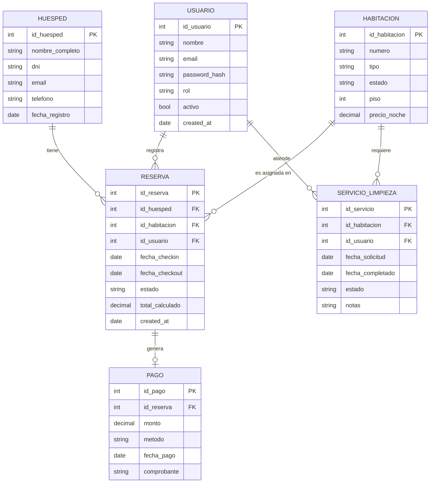
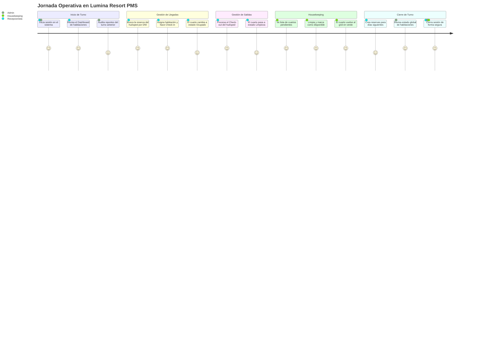
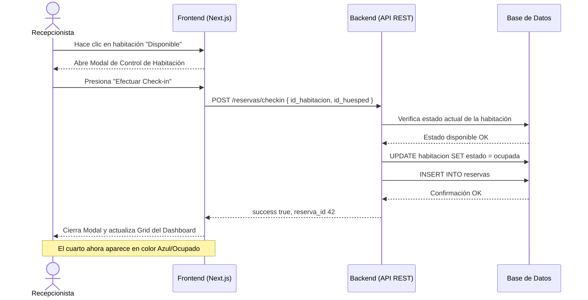
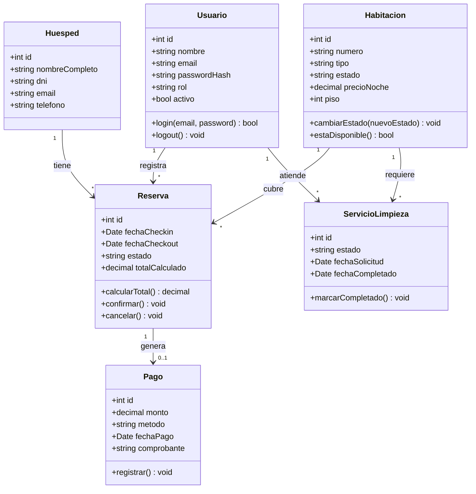
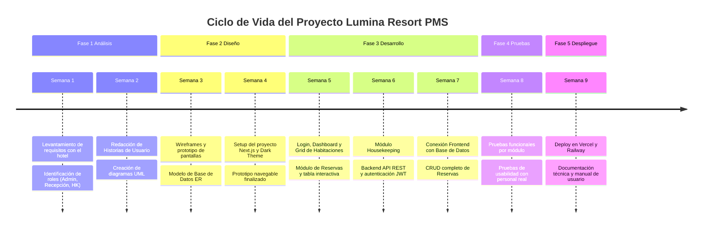

# 📊 Diagramas del Sistema: Lumina Resort PMS

Colección de diagramas técnicos y de negocio del Sistema de Gestión Hotelera.
Todos los diagramas están escritos en **Mermaid** y son renderizables en GitHub, GitLab y VS Code (con la extensión "Markdown Preview Mermaid Support").

> **Nota:** Estos diagramas representan una **propuesta inicial** de la arquitectura. Pueden cambiar en iteraciones futuras del proyecto según los requerimientos definitivos del equipo de desarrollo.

---

## Diagrama 1: Entidad-Relación (Base de Datos)

Representa el modelo de datos relacional propuesto para el sistema. Cubre las entidades centrales del negocio hotelero y sus relaciones de cardinalidad.

---

## Diagrama 2: Journey — Flujo de Trabajo por Rol

Muestra la experiencia de cada actor durante su jornada operativa en el sistema. Es visualmente llamativo y demuestra que el equipo diseñó el software pensando en el usuario final de cada área.

---

## Diagrama 3: Secuencia — Proceso de Check-in

Ilustra la interacción cronológica entre el Recepcionista, el Frontend (Next.js), el Backend (API) y la Base de Datos al momento de registrar la entrada de un huésped. Fundamental para demostrar el flujo técnico del sistema.

---

## Diagrama 4: Clases (Diseño Orientado a Objetos)

Representa la estructura estática del sistema desde el punto de vista de la Programación Orientada a Objetos. Muestra las clases principales, sus atributos, métodos y relaciones de herencia/asociación.

---

## Diagrama 5: Timeline — Fases del Proyecto

Visualiza el ciclo de vida del proyecto distribuido en fases temporales. Ideal para demostrar planificación formal del trabajo, equivalente a un WBS resumido en línea de tiempo.

