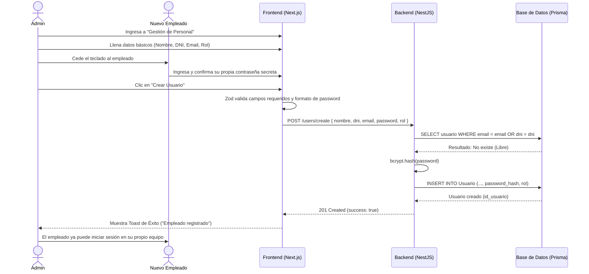
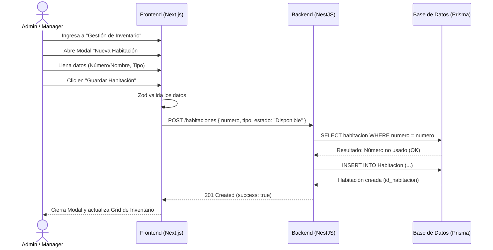
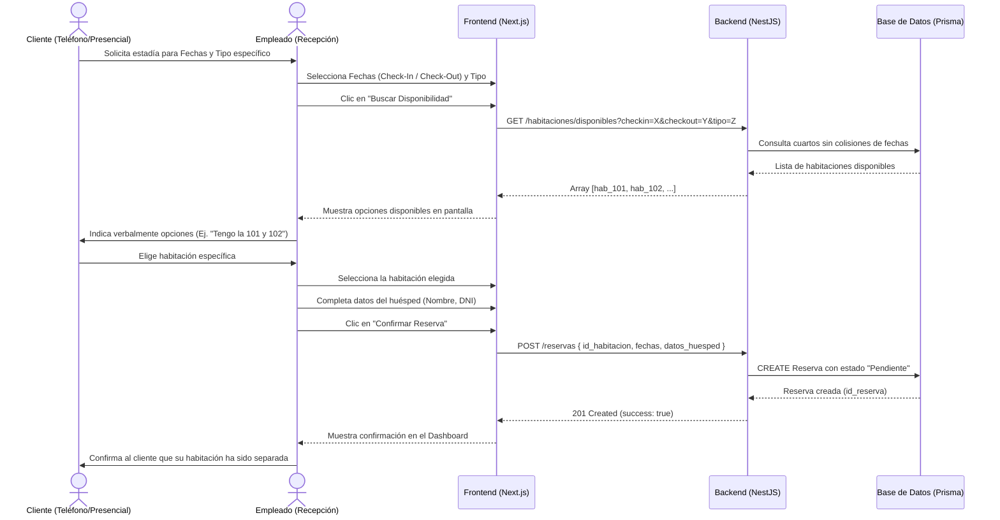
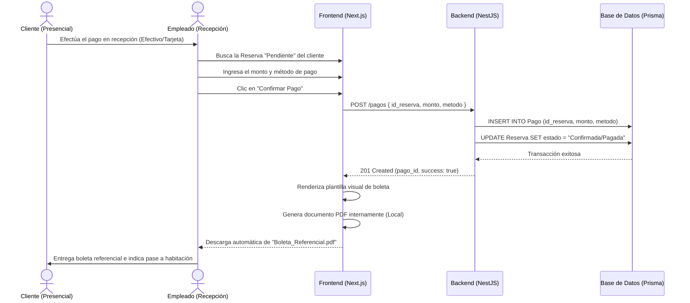

# 📊 Diagramas de Secuencia: Operaciones y Setup - Lumina Resort

A continuación se detallan los flujos de interacción del sistema para las fases de configuración (Setup) y la operación recurrente. Se han incluido notas guía para facilitar la exposición de la lógica de negocio y arquitectura.

---

## Diagrama 1: Creación de Empleado/Manager (Fase Setup)

> **Guion para Exposición:**  
> *"Este diagrama representa el primer paso para inicializar la seguridad del PMS. Mostramos cómo el Admin y el Nuevo Empleado interactúan presencialmente frente a la pantalla. El Admin ingresa los datos básicos, pero es el empleado quien digita su propia contraseña por seguridad. Luego, el Frontend valida que los campos estén completos usando Zod antes de enviar la petición. El Backend (NestJS) juega un rol crítico aquí: verifica en la base de datos que no exista otro empleado con el mismo DNI o Email para evitar duplicados. Finalmente, NestJS encripta la contraseña usando bcrypt antes de guardarla, asegurando que ni siquiera los administradores puedan ver las claves reales de su personal."*

---

## Diagrama 2: Creación de Habitación (Fase Setup)

> **Guion para Exposición:**  
> *"Aquí vemos cómo el hotel alimenta su inventario de habitaciones. Al ser un hotel turístico, simplificamos la lógica eliminando el concepto engorroso de 'pisos' y nos centramos en el Número o Nombre de la habitación y su Tipo (Sencilla, Suite, etc.). El administrador llena los datos, el Frontend los valida y envía el POST al servidor. El Backend tiene una regla de negocio clave: verificar que no estemos creando un número de habitación que ya existe. Al confirmar que está libre, la habitación se guarda y nace inmediatamente con el estado de 'Disponible', lista para aparecer en color verde en nuestro Dashboard interactivo."*

---

## Diagrama 3: Reserva de Habitación (Uso Recurrente)

> **Guion para Exposición:**  
> *"Este flujo demuestra cómo nuestro sistema asiste al recepcionista para evitar el Overbooking. Cuando un cliente solicita hospedaje, el empleado no busca a ciegas; ingresa las fechas deseadas y el tipo de cuarto. El Backend cruza las fechas contra la base de datos y devuelve solo las habitaciones que no tienen reservas activas en ese periodo. Luego, vemos la interacción real: el empleado le narra al cliente las opciones disponibles y, una vez que el cliente escoge, el empleado registra los datos del huésped y confirma la reserva. Es importante notar que en este punto la habitación solo se separa temporalmente, el pago ocurre en un proceso distinto."*

---

## Diagrama 4: Confirmación de Pago y Boleta (Uso Recurrente)

> **Guion para Exposición:**  
> *"Finalmente, explicamos cómo se cierra el ciclo para que el cliente pueda ocupar físicamente el cuarto. Una vez que el cliente paga en recepción, el empleado asocia el pago a la reserva previamente separada. El Backend registra la transacción y cambia el estado de la reserva. Lo más interesante a nivel técnico aquí es que, dado que somos un sistema cerrado sin facturación electrónica externa, nuestro Frontend en Next.js genera un documento PDF referencial usando los datos locales al instante. Esto nos ahorra costos de APIs externas y le da al cliente un comprobante físico o digital para que pueda pasar formalmente a su habitación."*

