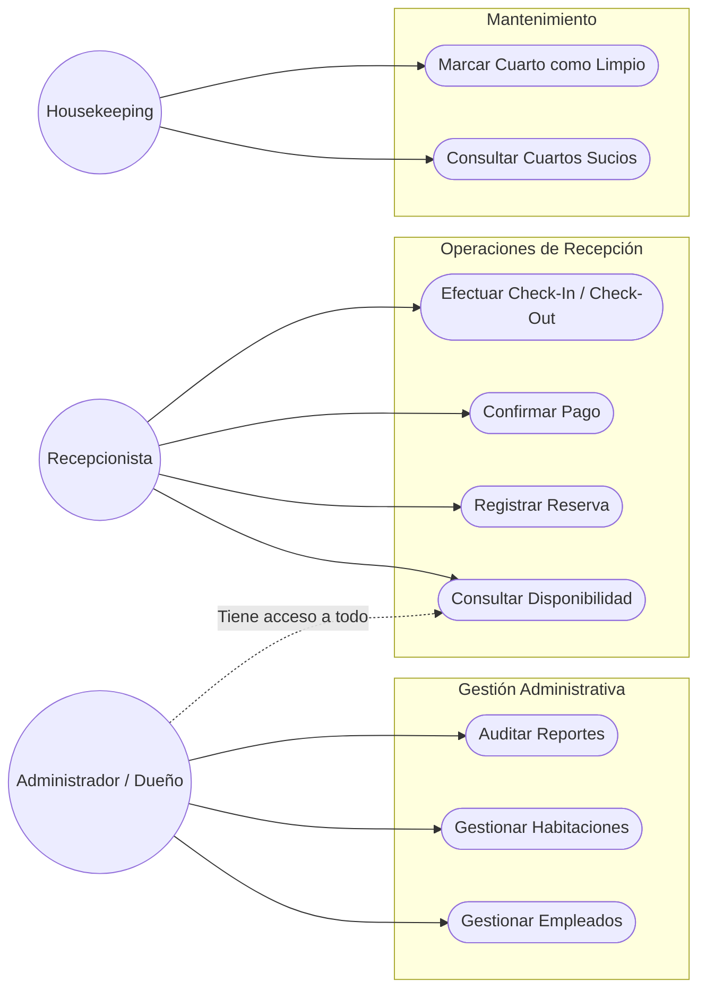
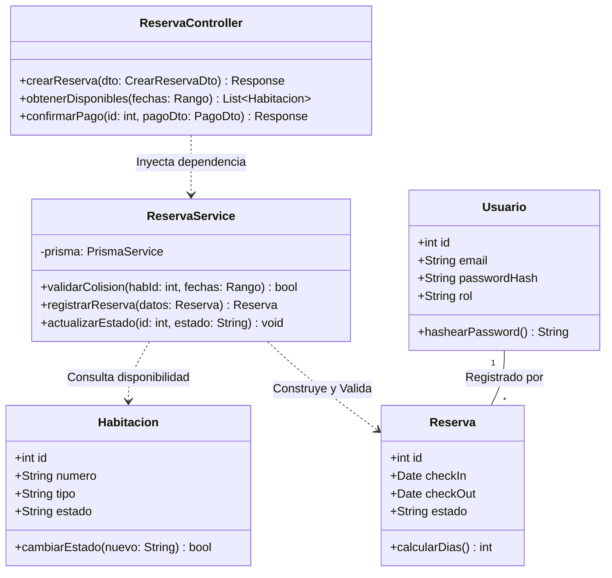
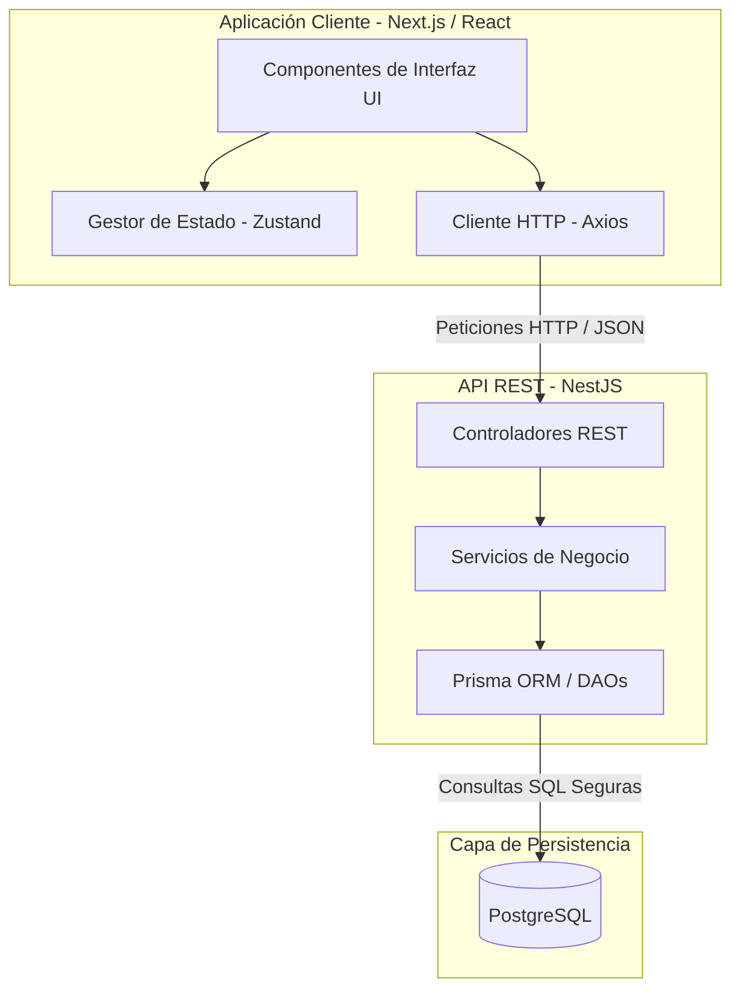

# 📊 Diagramas Complementarios: Marco Teórico

Este documento contiene los diagramas estructurales y de comportamiento requeridos para completar el marco teórico del proyecto. 

Para adaptarnos a las expectativas de un profesor que busca un enfoque tradicional (como el de Java/NetBeans), hemos centrado el **Diagrama de Clases** en nuestro Backend (NestJS), el cual es fuertemente tipado y estrictamente Orientado a Objetos (utiliza Controladores, Servicios e Inyección de Dependencias, exactamente igual que Java Spring Boot). De esta forma, el diseño cuadra perfectamente con la teoría académica, respetando nuestro stack moderno.

---

## 1. Diagrama de Casos de Uso

> **Guion para Exposición:**  
> *"Profesor, compañeros, aquí presentamos el Diagrama de Casos de Uso. Este diagrama ilustra las interacciones principales de los Actores con el PMS (Property Management System). Hemos dividido los casos en tres grandes subsistemas: Gestión Administrativa (exclusiva del Dueño/Admin), Operaciones de Recepción (el core del negocio) y Mantenimiento/Housekeeping. Esto demuestra que nuestro sistema no solo reserva cuartos, sino que encapsula el flujo de trabajo completo del personal del hotel."*

---

## 2. Diagrama de Clases (Arquitectura del Backend)

> **Guion para Exposición:**  
> *"Para la estructura interna del código, este es nuestro Diagrama de Clases. Aunque nuestro Frontend usa componentes de React, nuestro Backend (NestJS) trabaja bajo el paradigma Orientado a Objetos puro. Al igual que en entornos tradicionales como Java, aplicamos el patrón de Inyección de Dependencias. Tenemos Controladores que reciben las peticiones HTTP, que a su vez llaman a los Servicios (donde vive la regla de negocio, como validar colisiones de fechas), y finalmente interactúan con nuestras clases de Entidad que mapean la Base de Datos. Es una arquitectura limpia y robusta."*

---

## 3. Diagrama de Componentes

> **Guion para Exposición:**  
> *"El Diagrama de Componentes muestra la vista de despliegue lógico de nuestro proyecto. Hemos construido el sistema de forma desacoplada. Del lado del cliente (Frontend), tenemos la UI construida en Next.js gestionando el estado con Zustand y comunicándose vía Axios. Del lado del servidor (Backend), los componentes de NestJS procesan las peticiones y utilizan Prisma ORM como puente de acceso seguro hacia nuestra base de datos relacional en PostgreSQL."*

