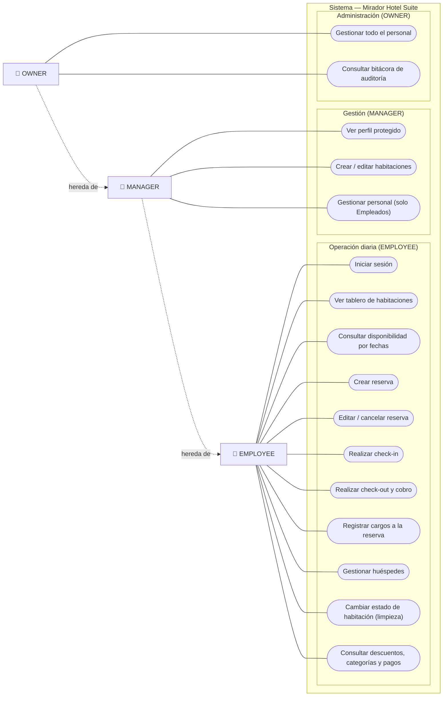

# Diagrama de Casos de Uso — Mirador Hotel Suite

## Descripción

El diagrama de casos de uso describe las funcionalidades que el sistema Mirador Hotel Suite
ofrece a su personal y quién puede ejecutarlas. Al tratarse de un sistema interno (B2B), no
existen actores externos como clientes finales: los actores son los **roles del personal**
del hotel, gobernados por el control de acceso basado en roles (RBAC) del backend.

Se identifican tres actores con una relación de **generalización** jerárquica:
`EMPLOYEE` < `MANAGER` < `OWNER`. Cada rol superior hereda todos los casos de uso del
inferior y suma los suyos propios. El **Empleado** (típicamente recepción y limpieza)
concentra la operación diaria: gestión de reservas, check-in/check-out con cobro, registro
de cargos, atención de huéspedes y actualización del estado físico de las habitaciones
(housekeeping). El **Manager** suma la administración del inventario de habitaciones y la
gestión del personal a su cargo. El **Owner** añade el control total del personal y el
acceso a la bitácora de auditoría del sistema.

Todos los casos de uso, salvo *Iniciar sesión*, requieren autenticación previa mediante
JWT. A continuación se presenta el diagrama de casos de uso:

## Notas

- **Generalización de actores.** La flecha punteada "hereda de" indica que `OWNER` puede
  ejecutar todos los casos de uso de `MANAGER`, y este los de `EMPLOYEE`. Por eso los casos
  de uso solo se asocian al rol mínimo que los habilita, evitando duplicar líneas.
- **Relación con el RBAC del código.** Las restricciones provienen de los guards
  (`JwtAuthGuard`, `RolesGuard`) y el decorador `@Roles()`:
  - *Crear / editar habitaciones* → `@Roles('OWNER','MANAGER')`.
  - *Ver perfil protegido* → `@Roles('OWNER','MANAGER')`.
  - *Gestionar personal* → controlador de empleados con `@Roles('OWNER','MANAGER')`; un
    Manager solo puede crear/editar Empleados (no Managers ni Owners), de ahí los dos casos
    de uso diferenciados (*solo Empleados* vs *todo el personal*).
  - *Consultar bitácora de auditoría* → `@Roles('OWNER')`.
  - El resto de operaciones (reservas, check-in/out, cargos, huéspedes, estado de
    habitación) solo exige autenticación, por lo que están disponibles para los tres roles.
- **Check-out y cobro.** El caso de uso *Realizar check-out y cobro* engloba el cálculo de
  totales (noches × tarifa + cargos − descuento) y el registro del pago, que el sistema
  ejecuta de forma transaccional.
- **Housekeeping.** *Cambiar estado de habitación* cubre la vista de servicio/limpieza, que
  marca los cuartos como disponibles tras la limpieza.

---

## Especificaciones de los casos de uso

Cada caso de uso del diagrama se detalla a continuación mediante una ficha con su actor,
precondiciones, flujo principal, flujos alternativos (excepciones) y postcondición. Los
flujos reflejan el comportamiento real del backend (validaciones, estados y códigos de
error HTTP).

### CU-01 · Iniciar sesión

- **Actor:** Empleado, Manager u Owner.
- **Precondición:** El usuario posee credenciales registradas.
- **Flujo principal:**
  1. El actor ingresa usuario y contraseña en la pantalla de login.
  2. El frontend envía `POST /auth/login`.
  3. El backend busca al empleado por `username` y verifica la contraseña con bcrypt.
  4. Si es correcta, emite un JWT con `{ sub, username, role }` y devuelve datos básicos.
  5. El frontend guarda el token en Zustand/localStorage y redirige al dashboard.
- **Flujos alternativos:**
  - 3a. Usuario inexistente o contraseña incorrecta → `401 Credenciales inválidas`.
- **Postcondición:** Sesión activa; el token se adjunta como `Bearer` en peticiones futuras.

### CU-02 · Consultar disponibilidad por fechas

- **Actor:** Empleado (cualquier rol autenticado).
- **Precondición:** Sesión activa.
- **Flujo principal:**
  1. El actor selecciona check-in, check-out y tipo de habitación.
  2. El frontend envía `GET /rooms/availability`.
  3. El backend valida que `checkOut > checkIn`.
  4. Devuelve las habitaciones del tipo pedido que no estén en `MAINTENANCE` y que no tengan
     reservas `PENDING`/`ACTIVE` solapadas con el rango.
- **Flujos alternativos:**
  - 3a. `checkOut <= checkIn` → `400` fecha de salida inválida.
- **Postcondición:** Se muestra la lista de habitaciones libres en ese rango.

### CU-03 · Crear reserva

- **Actor:** Empleado.
- **Precondición:** Existe al menos una habitación libre en el rango (CU-02).
- **Flujo principal:**
  1. El actor elige una habitación disponible e ingresa los datos del huésped (DNI, nombre,
     correo, teléfono).
  2. El frontend envía `POST /reservations`.
  3. El backend valida las fechas y que la habitación exista.
  4. Verifica que no haya solapamiento con otras reservas `PENDING`/`ACTIVE`.
  5. Hace *upsert* del huésped por su DNI.
  6. Crea la reserva en estado `PENDING`, fija `rateSnapshot` con el precio actual de la
     habitación y registra al empleado creador.
  7. Registra la acción en auditoría (`CREATE`).
- **Flujos alternativos:**
  - 3a. Fechas inválidas → `400`. · 3b. Habitación inexistente → `404`.
  - 4a. Solapamiento de fechas → `409` habitación ya reservada.
- **Postcondición:** Reserva creada en estado `PENDING`.

### CU-04 · Editar reserva

- **Actor:** Empleado.
- **Precondición:** La reserva está en estado `PENDING`.
- **Flujo principal:**
  1. El actor modifica fechas, habitación y/o datos del huésped.
  2. El frontend envía `PATCH /reservations/:id`.
  3. El backend confirma que la reserva sigue `PENDING` y valida las nuevas fechas.
  4. Si cambian fechas o habitación, revalida el no solapamiento; si cambia la habitación,
     actualiza `rateSnapshot`.
  5. Guarda los cambios y registra auditoría (`UPDATE`).
- **Flujos alternativos:**
  - 3a. La reserva no está `PENDING` → `400` solo se editan reservas pendientes.
  - 3b. Fechas inválidas → `400`. · 4a. Solapamiento → `409`.
- **Postcondición:** Reserva actualizada.

### CU-05 · Cancelar reserva

- **Actor:** Empleado.
- **Precondición:** La reserva está en estado `PENDING`.
- **Flujo principal:**
  1. El actor solicita cancelar la reserva (`PATCH /reservations/:id/cancel`).
  2. El backend cambia el estado a `CANCELLED` y registra auditoría (`CANCEL`).
- **Flujos alternativos:**
  - 1a. La reserva no está `PENDING` → `400` solo se cancelan reservas pendientes.
- **Postcondición:** Reserva en estado `CANCELLED`.

### CU-06 · Realizar check-in

- **Actor:** Empleado.
- **Precondición:** Reserva `PENDING` y habitación en estado `AVAILABLE`.
- **Flujo principal:**
  1. El actor confirma la llegada del huésped (`PATCH /reservations/:id/checkin`).
  2. El backend valida que la reserva esté `PENDING` y la habitación `AVAILABLE`.
  3. En una transacción: pasa la reserva a `ACTIVE` con `actualCheckIn = ahora` y la
     habitación a `OCCUPIED`.
  4. Registra auditoría (`CHECKIN`).
- **Flujos alternativos:**
  - 2a. Reserva no `PENDING` → `400`. · 2b. Habitación no disponible → `400`.
- **Postcondición:** Reserva `ACTIVE`, habitación `OCCUPIED`.

### CU-07 · Realizar check-out y cobro

- **Actor:** Empleado.
- **Precondición:** Reserva en estado `ACTIVE`.
- **Flujo principal:**
  1. El actor inicia el check-out indicando método de pago y, opcionalmente, un descuento
     (`PATCH /reservations/:id/checkout`).
  2. El backend valida que la reserva esté `ACTIVE`, que el método de pago exista y que el
     descuento (si se indicó) exista y esté activo.
  3. Calcula: noches, `roomTotal = tarifa × noches`, `chargesTotal` (suma de cargos),
     `subtotal`, `discountAmount` y `grandTotal`.
  4. En una transacción: pasa la reserva a `COMPLETED` con `actualCheckOut = ahora`, crea el
     `Payment` con los totales y pone la habitación en `CLEANING`.
  5. Registra auditoría (`CHECKOUT`).
- **Flujos alternativos:**
  - 2a. Reserva no `ACTIVE` → `400`. · 2b. Descuento inexistente → `404`.
  - 2c. Descuento inactivo → `400`. · 2d. Método de pago inválido → `400`.
- **Postcondición:** Reserva `COMPLETED`, pago registrado, habitación en `CLEANING`.

### CU-08 · Registrar cargo a la reserva

- **Actor:** Empleado.
- **Precondición:** Reserva en estado `ACTIVE`.
- **Flujo principal:**
  1. El actor agrega un consumo o servicio (`POST /reservations/:id/charges`) indicando
     categoría, descripción e importe.
  2. El backend valida que la reserva esté `ACTIVE` y que la categoría de gasto exista.
  3. Crea el `RoomCharge` asociado a la reserva y al empleado que lo registra.
- **Flujos alternativos:**
  - 2a. Reserva inexistente → `404`. · 2b. Reserva no `ACTIVE` → `400`.
  - 2c. Categoría inexistente → `404`.
- **Postcondición:** Cargo registrado; se sumará al `chargesTotal` en el check-out.

### CU-09 · Gestionar huéspedes

- **Actor:** Empleado.
- **Precondición:** Sesión activa.
- **Flujo principal:**
  1. El actor lista/busca huéspedes, consulta el detalle (con historial de reservas), o crea
     y edita un huésped (`GET/POST/PATCH /guests`).
  2. El backend persiste los datos garantizando que el DNI (`nationalId`) sea único.
- **Flujos alternativos:**
  - 2a. DNI duplicado al crear/editar → `409` ya existe un huésped con ese DNI.
- **Postcondición:** Datos del huésped creados o actualizados.

### CU-10 · Cambiar estado de habitación (housekeeping)

- **Actor:** Empleado.
- **Precondición:** Sesión activa; la habitación existe.
- **Flujo principal:**
  1. Desde la vista de servicio/limpieza, el actor marca un cuarto (p. ej. `CLEANING` →
     `AVAILABLE`) mediante `PATCH /rooms/:id/status`.
  2. El backend actualiza el estado y registra auditoría (`UPDATE`).
- **Flujos alternativos:**
  - 1a. Habitación inexistente → `404`.
- **Postcondición:** La habitación queda con el nuevo estado, visible en tiempo real.

### CU-11 · Crear habitación

- **Actor:** Manager u Owner.
- **Precondición:** Rol `OWNER` o `MANAGER` (RBAC).
- **Flujo principal:**
  1. El actor registra una nueva habitación con número, tipo y precio (`POST /rooms`).
  2. El backend valida que el número no exista, crea la habitación en estado `AVAILABLE` y
     registra auditoría (`CREATE`).
- **Flujos alternativos:**
  - 2a. Número de habitación ya existente → `409`.
- **Postcondición:** Habitación creada y disponible en el inventario.

### CU-12 · Editar habitación

- **Actor:** Manager u Owner.
- **Precondición:** Rol `OWNER` o `MANAGER`; la habitación existe.
- **Flujo principal:**
  1. El actor modifica número, tipo o precio (`PATCH /rooms/:id`).
  2. Si cambia el número, el backend valida que no choque con otra habitación; guarda los
     cambios y registra auditoría (`UPDATE`).
- **Flujos alternativos:**
  - 2a. Habitación inexistente → `404`. · 2b. Número duplicado → `409`.
- **Postcondición:** Habitación actualizada.

### CU-13 · Gestionar personal (crear / editar empleado)

- **Actor:** Manager (solo Empleados) u Owner (cualquier rol).
- **Precondición:** Rol `OWNER` o `MANAGER` (RBAC).
- **Flujo principal:**
  1. El actor crea o edita un empleado con sus datos, cargo y turno (`POST` / `PATCH
     /employees`).
  2. El backend valida que `username`, `dni` y `email` sean únicos, derivando el rol a partir
     del cargo y cifrando la contraseña con bcrypt.
  3. Guarda los cambios y registra auditoría (`CREATE` / `UPDATE`).
- **Flujos alternativos:**
  - 2a. Un Manager intenta crear/asignar un cargo distinto de Empleado → `409` (los Managers
    solo gestionan Empleados).
  - 2b. Un Manager intenta ver/editar a un Manager u Owner → `403`.
  - 2c. `username`, `dni` o `email` duplicados → `409`.
- **Postcondición:** Empleado creado o actualizado.

### CU-14 · Consultar bitácora de auditoría

- **Actor:** Owner.
- **Precondición:** Rol `OWNER` (RBAC).
- **Flujo principal:**
  1. El actor consulta la bitácora con filtros opcionales por tabla, empleado o rango de
     fechas (`GET /audit-logs`).
  2. El backend devuelve los registros (quién, qué acción, sobre qué fila, valor previo y
     nuevo), ordenados por fecha descendente.
- **Postcondición:** Se muestra el historial de cambios del sistema.

### CU-15 · Consultas de apoyo (tablero, catálogos y pago)

- **Actor:** Empleado.
- **Precondición:** Sesión activa.
- **Flujo principal:**
  1. El actor visualiza el tablero de habitaciones (`GET /rooms`) o consulta catálogos de
     apoyo: descuentos (`GET /discounts`), categorías de gasto (`GET /expense-categories`) y
     el pago de una reserva (`GET /payments/:reservationId`).
  2. El backend devuelve la información solicitada.
- **Flujos alternativos:**
  - 1a. La reserva consultada no tiene pago registrado → `404`.
- **Postcondición:** Se presenta la información consultada (solo lectura).
