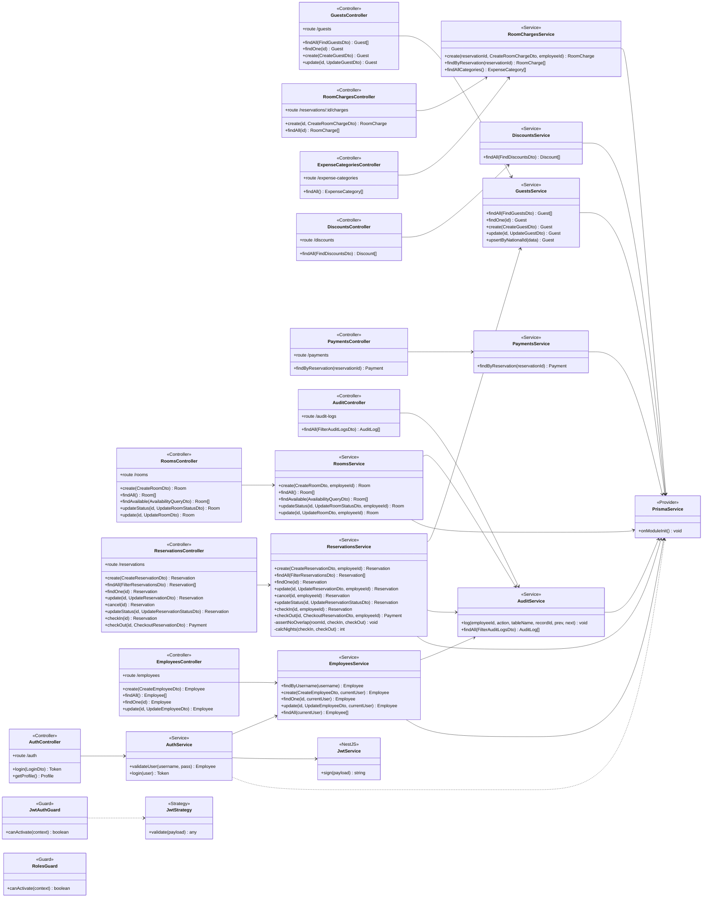

# Diagrama de Clases — Mirador Hotel Suite

## Descripción

El diagrama de clases representa la estructura orientada a objetos del backend de Mirador
Hotel Suite, construido con el framework NestJS. A diferencia del modelo de datos —que
describe las tablas persistidas—, este diagrama muestra las **clases de software** que
implementan la lógica de la aplicación y las dependencias entre ellas.

La arquitectura sigue un patrón en capas claramente definido. La **capa de controladores**
(`*Controller`) expone los endpoints REST: recibe las peticiones HTTP, valida los datos de
entrada mediante objetos de transferencia (DTOs) y delega el trabajo en los servicios; no
contiene lógica de negocio. La **capa de servicios** (`*Service`) concentra toda la lógica
de dominio —validaciones, cálculo de disponibilidad por solapamiento de fechas, totales de
pago, reglas de roles— y es la única que accede a los datos. Por debajo, una **capa de
infraestructura transversal** provee la persistencia (`PrismaService`), la seguridad
(`JwtAuthGuard`, `RolesGuard`, `JwtStrategy`) y la emisión de tokens (`JwtService`).

Las relaciones del diagrama corresponden a la **inyección de dependencias** de NestJS: cada
controlador depende de su servicio, y los servicios dependen de `PrismaService` y, cuando
procede, de otros servicios (por ejemplo, `ReservationsService` reutiliza `GuestsService` y
`AuditService`, y `AuthService` reutiliza `EmployeesService`). El control de acceso por
roles (RBAC) se aplica de forma transversal mediante guards y el decorador `@Roles()`. A
continuación se presenta el diagrama de clases:

## Notas

- **Estereotipos.** `<<Controller>>` capa de presentación REST · `<<Service>>` lógica de
  negocio · `<<Provider>>` / `<<Guard>>` / `<<Strategy>>` infraestructura de NestJS.
- **DTOs.** Los parámetros como `CreateReservationDto`, `UpdateRoomDto` o
  `FilterAuditLogsDto` son clases de transferencia de datos validadas con `class-validator`
  y Zod; no se dibujan como clases propias para no saturar el diagrama, pero aparecen como
  tipos de los parámetros de los métodos.
- **RBAC transversal.** Todos los controladores aplican `JwtAuthGuard`. Los que llevan el
  decorador `@Roles()` aplican además `RolesGuard`: `EmployeesController` y el `profile` de
  `AuthController` exigen `OWNER`/`MANAGER`; `AuditController` exige `OWNER`;
  `RoomsController.create/update` exige `OWNER`/`MANAGER`; el resto de operaciones de
  reservas admite los tres roles.
- **Reutilización entre servicios.** `AuthService` valida credenciales a través de
  `EmployeesService`; `ReservationsService` resuelve al huésped con `GuestsService` y
  registra trazas con `AuditService`; `RoomsService` y `EmployeesService` también auditan
  sus cambios. `PrismaService` es el punto único de acceso a la base de datos.
- **Métodos privados.** En `ReservationsService`, `assertNoOverlap()` implementa la
  validación de overbooking por solapamiento de fechas y `calcNights()` calcula las noches
  facturables; ambos son auxiliares internos (visibilidad `-`).
