# Diagrama de Componentes — Mirador Hotel Suite

## Descripción

El diagrama de componentes representa la arquitectura física del sistema Mirador Hotel Suite
y la manera en que sus piezas de software se distribuyen y comunican entre sí. La solución
adopta una arquitectura cliente-servidor de tres capas claramente diferenciadas, cada una
desplegada en un proveedor de hosting independiente: el **frontend** sobre Vercel, el
**backend** sobre Render y la **base de datos** sobre Supabase.

La capa de presentación es una aplicación Next.js (App Router) que el personal del hotel
consume mediante el navegador. Dentro de ella, las páginas del dashboard se apoyan en
componentes de interfaz, formularios validados con React Hook Form y Zod, un almacén de
estado global (Zustand) que conserva la sesión, y un cliente HTTP (Axios) que centraliza
las llamadas a la API y adjunta automáticamente el token de autenticación. La capa de
negocio es una API REST construida con NestJS y organizada en módulos de dominio
independientes —autenticación, habitaciones, reservas, huéspedes, personal, cargos,
descuentos, pagos y auditoría—, cada uno con su controlador y su servicio, protegidos de
forma transversal por los guards de seguridad y el control de acceso por roles. Finalmente,
la capa de datos es una base PostgreSQL normalizada a la que solo se accede a través del
servicio de persistencia (Prisma), que actúa como punto único de entrada.

El diagrama se lee de abajo hacia arriba: el flujo de una petición parte del usuario,
atraviesa el cliente HTTP del frontend, llega al controlador del módulo correspondiente del
backend, pasa por su servicio y por la capa de persistencia, y termina consultando o
escribiendo en la base de datos. A continuación se presenta el diagrama:

```mermaid
flowchart BT
    user(["👤 Personal del hotel<br/>Owner · Manager · Employee"])

    %% ---------- FRONTEND ----------
    subgraph vercel["☁️ Vercel"]
        subgraph web["Frontend — Next.js 16 (App Router)"]
            pages["Páginas / Dashboard<br/>login · rooms · staff · reservas<br/>calendario · servicio"]
            ui["Componentes UI<br/>Shadcn + Tailwind v4"]
            forms["Formularios<br/>React Hook Form + Zod"]
            store["Estado — Zustand<br/>useAuthStore + localStorage"]
            http["Cliente HTTP — Axios<br/>interceptor Bearer / logout 401<br/>(lib/routes.ts)"]
            pages --> ui
            pages --> forms
            pages --> store
            pages --> http
            http --> store
        end
    end

    %% ---------- BACKEND ----------
    subgraph render["☁️ Render"]
        subgraph api["Backend — NestJS 11"]
            subgraph sec["Seguridad (transversal)"]
                jwtguard["JwtAuthGuard"]
                rolesguard["RolesGuard + @Roles()"]
                jwtstrat["JwtStrategy (Passport)"]
            end

            subgraph m_auth["AuthModule · /auth"]
                authctl["AuthController"]
                authsvc["AuthService<br/>(bcrypt + JWT)"]
                authctl --> authsvc
            end

            subgraph m_rooms["RoomsModule · /rooms"]
                roomsctl["RoomsController"]
                roomssvc["RoomsService<br/>(disponibilidad por solapamiento)"]
                roomsctl --> roomssvc
            end

            subgraph m_res["ReservationsModule · /reservations"]
                resctl["ReservationsController"]
                ressvc["ReservationsService<br/>(check-in / check-out / overbooking)"]
                resctl --> ressvc
            end

            subgraph m_guests["GuestsModule · /guests"]
                guestsctl["GuestsController"]
                guestssvc["GuestsService"]
                guestsctl --> guestssvc
            end

            subgraph m_emp["EmployeesModule · /employees"]
                empctl["EmployeesController"]
                empsvc["EmployeesService"]
                empctl --> empsvc
            end

            subgraph m_charges["RoomChargesModule"]
                chargesctl["RoomChargesController<br/>/reservations/:id/charges"]
                expctl["ExpenseCategoriesController<br/>/expense-categories"]
                chargessvc["RoomChargesService"]
                chargesctl --> chargessvc
                expctl --> chargessvc
            end

            subgraph m_disc["DiscountsModule · /discounts"]
                discctl["DiscountsController"]
                discsvc["DiscountsService"]
                discctl --> discsvc
            end

            subgraph m_pay["PaymentsModule · /payments"]
                payctl["PaymentsController"]
                paysvc["PaymentsService<br/>(subtotal · descuento · total)"]
                payctl --> paysvc
            end

            subgraph m_audit["AuditModule · /audit-logs"]
                auditctl["AuditController"]
                auditsvc["AuditService"]
                auditctl --> auditsvc
            end

            prisma["PrismaService<br/>@prisma/adapter-pg (singleton)"]

            %% guards protegen los controllers
            jwtguard -. protege .-> roomsctl
            jwtguard -. protege .-> resctl
            jwtguard -. protege .-> guestsctl
            jwtguard -. protege .-> empctl
            jwtguard -. protege .-> chargesctl
            jwtguard -. protege .-> expctl
            jwtguard -. protege .-> discctl
            jwtguard -. protege .-> payctl
            jwtguard -. protege .-> auditctl
            rolesguard -. RBAC .-> jwtguard
            authsvc --> jwtstrat

            %% servicios -> acceso a datos
            authsvc --> prisma
            roomssvc --> prisma
            ressvc --> prisma
            guestssvc --> prisma
            empsvc --> prisma
            chargessvc --> prisma
            discsvc --> prisma
            paysvc --> prisma
            auditsvc --> prisma
        end
    end

    %% ---------- BASE DE DATOS ----------
    subgraph supabase["☁️ Supabase"]
        db[("PostgreSQL — 16 modelos (normalizado)<br/>Employee · JobPosition · Shift<br/>Room · RoomType · RoomStatus<br/>Guest · Reservation · ReservationStatus<br/>RoomCharge · ExpenseCategory<br/>Payment · PaymentMethod · Discount<br/>AuditLog · AuditAction")]
    end

    %% ---------- CONEXIONES ENTRE CAPAS ----------
    user -->|HTTPS| pages

    http -->|POST /auth/login| authctl
    http -->|/rooms| roomsctl
    http -->|/reservations| resctl
    http -->|/guests| guestsctl
    http -->|/employees| empctl
    http -->|/reservations/:id/charges| chargesctl
    http -->|/expense-categories| expctl
    http -->|/discounts| discctl
    http -->|/payments| payctl
    http -->|/audit-logs| auditctl

    prisma -->|SQL · pool DATABASE_URL<br/>direct DIRECT_URL| db
```

## Notas

- **Frontend (Vercel):** SPA con Next.js App Router. El token JWT vive en `useAuthStore`
  (Zustand, persistido en `localStorage`); el interceptor de Axios adjunta
  `Authorization: Bearer <token>` en cada petición y dispara logout ante un `401`.
  Las rutas de la API se centralizan en `lib/routes.ts` y los formularios usan
  React Hook Form + Zod.
- **Backend (Render):** API REST con NestJS organizada por módulos de dominio. Cada módulo
  expone un Controller (ruta indicada) y un Service que concentra la lógica. Las rutas
  protegidas pasan por `JwtAuthGuard` + `RolesGuard` (decorador `@Roles()`), y la
  autenticación se valida con `JwtStrategy` de Passport. Todo el acceso a datos se
  centraliza en `PrismaService` (singleton con adaptador `pg`).
- **Base de datos (Supabase):** PostgreSQL con **16 modelos** totalmente normalizados,
  incluyendo tablas catálogo (`RoomType`, `RoomStatus`, `ReservationStatus`, `JobPosition`,
  `Shift`, `PaymentMethod`, `ExpenseCategory`, `AuditAction`). Prisma usa `DATABASE_URL`
  (conexión pooled) para la app y `DIRECT_URL` (sin pool) para las migraciones.

> El detalle de campos y relaciones de los 16 modelos se documenta en el
> **Modelo de datos (ER)**, no en este diagrama de componentes.
