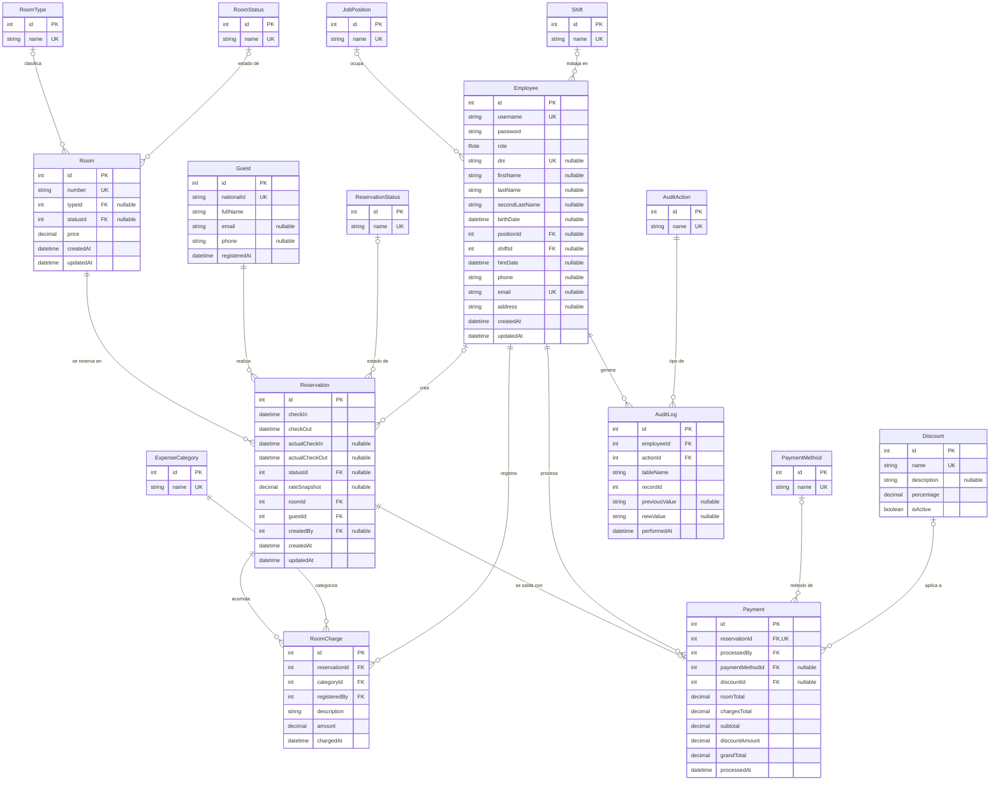

# Modelo de Datos (ER) — Mirador Hotel Suite

## Descripción

El modelo de datos describe la estructura lógica de la base de datos del sistema Mirador
Hotel Suite, implementada sobre PostgreSQL mediante el ORM Prisma. El esquema está compuesto
por **16 entidades** diseñadas siguiendo un criterio de normalización estricta, con el
objetivo de eliminar la redundancia y garantizar la integridad referencial de la
información operativa del hotel.

Las entidades se agrupan en dos grandes categorías. Por un lado, las **entidades de
dominio**, que representan los objetos centrales del negocio: el personal (`Employee`), las
habitaciones (`Room`), los huéspedes (`Guest`), las reservas (`Reservation`), los cargos
adicionales (`RoomCharge`), los pagos (`Payment`) y la bitácora de auditoría (`AuditLog`).
Por otro lado, las **tablas catálogo**, que aíslan en relaciones independientes los valores
que de otro modo se repetirían como texto: tipos y estados de habitación (`RoomType`,
`RoomStatus`), estados de reserva (`ReservationStatus`), métodos de pago (`PaymentMethod`),
categorías de gasto (`ExpenseCategory`), cargos y turnos del personal (`JobPosition`,
`Shift`), acciones de auditoría (`AuditAction`) y descuentos (`Discount`). Gracias a este
diseño, cualquier estado o clasificación se referencia mediante una clave foránea en lugar
de duplicarse, lo que facilita el mantenimiento y la consistencia de los datos.

El diagrama destaca además tres decisiones de modelado relevantes: la relación uno a uno
entre `Reservation` y `Payment` (cada reserva se salda con un único pago), el uso de campos
de tipo *snapshot* para congelar importes en el momento de la operación, y la trazabilidad
completa de las acciones a través de la entidad de auditoría. Se emplea la convención de
claves **PK** (primaria), **FK** (foránea) y **UK** (única). A continuación se presenta el
diagrama entidad-relación:

## Notas

- **Catálogos normalizados.** Los estados y tipos no se guardan como enums de texto en las
  tablas de dominio sino como FKs a tablas catálogo (`RoomType`, `RoomStatus`,
  `ReservationStatus`, `PaymentMethod`, `ExpenseCategory`, `JobPosition`, `Shift`,
  `AuditAction`). El único enum nativo que queda es `Role` en `Employee`.
- **Reserva ↔ Pago es 1:1.** `Payment.reservationId` es único (FK + UK): cada reserva
  tiene como máximo un pago, y el pago se cierra en el check-out.
- **Snapshots de importe.** `Reservation.rateSnapshot` y los totales de `Payment`
  (`roomTotal`, `chargesTotal`, `subtotal`, `discountAmount`, `grandTotal`) congelan los
  valores al momento de la operación, independizándolos de cambios futuros en `Room.price`
  o en los `Discount`.
- **Auditoría.** `AuditLog` registra quién (`employeeId`), qué acción (`actionId`) y sobre
  qué fila (`tableName` + `recordId`), guardando el valor previo y el nuevo.
- **Cardinalidades.** `|o` = cero o uno (FK opcional) · `||` = exactamente uno (FK
  obligatoria) · `o{` = cero o muchos.
