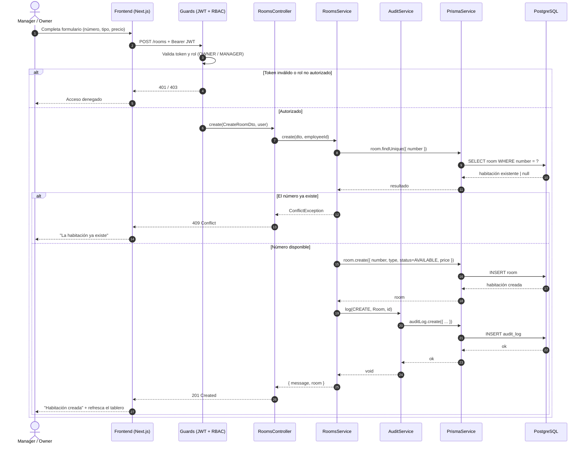
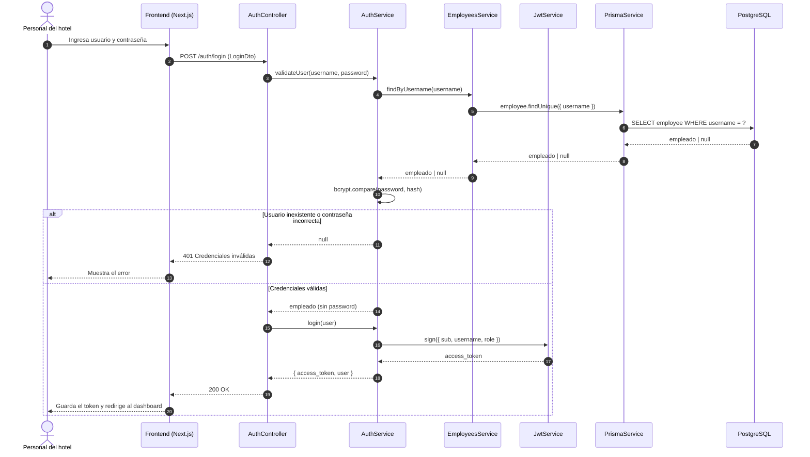
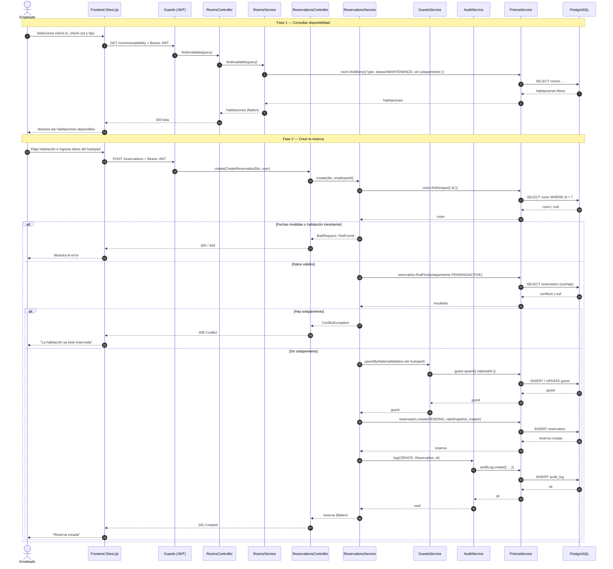
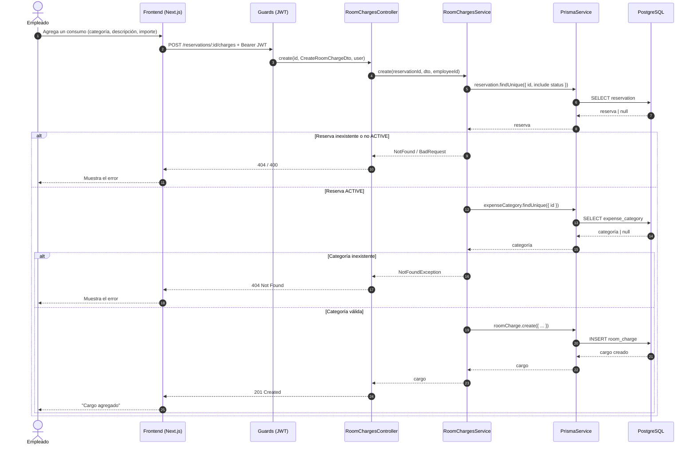

# Diagramas de Secuencia (vista detallada) — Lumina Resort PMS

## Descripción

Esta es la **vista detallada** de los diagramas de secuencia. La contraparte resumida
(Frontend · Backend · PostgreSQL), pensada para comunicar el flujo de un vistazo, está en
[`secuencias-resumen.md`](./secuencias-resumen.md).

Los diagramas de secuencia muestran *cómo* se realiza cada caso de uso a lo largo del
tiempo, modelando la interacción entre los componentes del sistema mediante mensajes
ordenados. Se emplea una vista de **caja blanca**: además del actor y el frontend, se
desglosa el backend en sus capas reales —guards de seguridad, controlador, servicio y
acceso a datos (`PrismaService`)— hasta llegar a la base de datos PostgreSQL y retornar la
respuesta al actor.

Cada diagrama corresponde a un escenario clave del sistema. Los mensajes con flecha continua
(`->>`) representan invocaciones; los de flecha punteada (`-->>`) representan retornos. Los
bloques `alt` modelan los caminos alternativos (por ejemplo, una validación fallida que
devuelve un error HTTP). Todos los escenarios, salvo el login, parten de una petición
autenticada con `Bearer` JWT que los guards validan antes de alcanzar el controlador.

---

## Secuencia 1 · Crear habitación

Realiza el caso de uso **CU-11**. Un Manager u Owner registra una nueva habitación; el
sistema valida que el número no exista, la crea en estado `AVAILABLE` y deja traza en la
auditoría.



### Notas

- **Guards primero.** `JwtAuthGuard` valida el token y `RolesGuard` el rol (`@Roles('OWNER',
  'MANAGER')`) antes de que la petición llegue al controlador; si fallan, se corta con
  `401`/`403` sin tocar la lógica de negocio.
- **Validación de unicidad.** El servicio consulta por `number` antes de insertar; si ya
  existe, lanza `ConflictException` (`409`) y no se crea nada.
- **Estado inicial.** La habitación se crea siempre en estado `AVAILABLE` (conectado por
  nombre a la tabla catálogo `RoomStatus`).
- **Auditoría.** Tras crear la habitación, `AuditService.log()` inserta un registro
  `CREATE` sobre la tabla `Room`; es parte del mismo flujo de la operación.

---

## Secuencia 2 · Iniciar sesión

Realiza el caso de uso **CU-01**. Es el único flujo público (sin guards): el controlador
delega en `AuthService`, que valida con `EmployeesService` y emite el token con `JwtService`.



### Notas

- `validateUser()` separa el `password` del objeto devuelto: el hash nunca sale del backend.
- El token se firma con la clave `JWT_SECRET` y lleva `sub` (id), `username` y `role`.

---

## Secuencia 3 · Crear reserva

Realiza los casos de uso **CU-02** y **CU-03**. Se divide en dos fases: la consulta de
disponibilidad (`RoomsService`) y la creación de la reserva (`ReservationsService`, que
reutiliza `GuestsService` y `AuditService`).



### Notas

- El no solapamiento se valida con `reservation.findFirst` sobre reservas `PENDING`/`ACTIVE`
  cuyo rango se cruza (`checkIn < checkOut` y `checkOut > checkIn`).
- El huésped se resuelve con `upsert` por DNI: se crea si es nuevo o se actualiza si ya
  existía, evitando duplicados.

---

## Secuencia 4 · Realizar check-in

Realiza el caso de uso **CU-06**. Valida los estados y aplica los cambios de reserva y
habitación dentro de una transacción.

```mermaid
sequenceDiagram
    autonumber
    actor U as Empleado
    participant FE as Frontend (Next.js)
    participant GD as Guards (JWT)
    participant VC as ReservationsController
    participant VS as ReservationsService
    participant AU as AuditService
    participant PR as PrismaService
    participant DB as PostgreSQL

    U->>FE: Confirma la llegada del huésped
    FE->>GD: PATCH /reservations/:id/checkin + Bearer JWT
    GD->>VC: checkIn(id, user)
    VC->>VS: checkIn(id, employeeId)
    VS->>PR: reservation.findUnique({ id, include status + room.status })
    PR->>DB: SELECT reservation + room
    DB-->>PR: datos
    PR-->>VS: reserva

    alt Reserva no PENDING o habitación no AVAILABLE
        VS-->>VC: BadRequestException
        VC-->>FE: 400 Bad Request
        FE-->>U: Muestra el motivo
    else Válido
        VS->>PR: $transaction [ reserva→ACTIVE (+actualCheckIn), habitación→OCCUPIED ]
        PR->>DB: UPDATE reservation; UPDATE room
        DB-->>PR: ok
        PR-->>VS: [ reserva, habitación ]
        VS->>AU: log(CHECKIN, Reservation, id)
        AU->>PR: auditLog.create({ ... })
        PR->>DB: INSERT audit_log
        DB-->>PR: ok
        PR-->>AU: ok
        AU-->>VS: void
        VS-->>VC: reserva (flatten)
        VC-->>FE: 200 Check-in realizado
        FE-->>U: Actualiza el tablero
    end
```

### Notas

- Los dos `UPDATE` (reserva y habitación) van en un `$transaction`: o se aplican ambos o se
  revierte todo, evitando estados inconsistentes.

---

## Secuencia 5 · Realizar check-out y cobro

Realiza el caso de uso **CU-07**. Valida estado, descuento y método de pago, calcula los
totales y persiste reserva, pago y estado de habitación en una transacción. El descuento es
opcional, por lo que su validación se modela con `opt`.

```mermaid
sequenceDiagram
    autonumber
    actor U as Empleado
    participant FE as Frontend (Next.js)
    participant GD as Guards (JWT)
    participant VC as ReservationsController
    participant VS as ReservationsService
    participant AU as AuditService
    participant PR as PrismaService
    participant DB as PostgreSQL

    U->>FE: Inicia el check-out (método de pago, descuento opcional)
    FE->>GD: PATCH /reservations/:id/checkout + Bearer JWT
    GD->>VC: checkOut(id, dto, user)
    VC->>VS: checkOut(id, dto, employeeId)
    VS->>PR: reservation.findUnique({ id, include status + room })
    PR->>DB: SELECT reservation + room
    DB-->>PR: datos
    PR-->>VS: reserva

    alt Reserva no ACTIVE
        VS-->>VC: BadRequestException
        VC-->>FE: 400 Bad Request
        FE-->>U: Muestra el error
    else Reserva ACTIVE
        opt Se indicó un descuento
            VS->>PR: discount.findUnique({ id })
            PR->>DB: SELECT discount
            DB-->>PR: descuento | null
            PR-->>VS: descuento
        end
        VS->>PR: paymentMethod.findUnique({ name })
        PR->>DB: SELECT payment_method
        DB-->>PR: método | null
        PR-->>VS: método

        alt Descuento inexistente/inactivo o método inválido
            VS-->>VC: NotFound / BadRequest
            VC-->>FE: 404 / 400
            FE-->>U: Muestra el error
        else Validaciones OK
            VS->>PR: roomCharge.aggregate(_sum amount)
            PR->>DB: SELECT SUM(amount) cargos
            DB-->>PR: total de cargos
            PR-->>VS: chargesTotal
            VS->>VS: Calcula roomTotal, subtotal, descuento y grandTotal
            VS->>PR: $transaction [ reserva→COMPLETED (+actualCheckOut), payment.create, habitación→CLEANING ]
            PR->>DB: UPDATE reservation; INSERT payment; UPDATE room
            DB-->>PR: ok
            PR-->>VS: [ reserva, payment ]
            VS->>AU: log(CHECKOUT, Reservation, id)
            AU->>PR: auditLog.create({ ... })
            PR->>DB: INSERT audit_log
            DB-->>PR: ok
            PR-->>AU: ok
            AU-->>VS: void
            VS-->>VC: { reserva, payment }
            VC-->>FE: 200 OK
            FE-->>U: Muestra el comprobante de pago
        end
    end
```

### Notas

- `roomCharge.aggregate` suma todos los cargos de la reserva para el `chargesTotal`.
- El cálculo de importes ocurre en memoria (`Prisma.Decimal`) y la escritura de reserva,
  pago y habitación se confirma en una sola transacción.

---

## Secuencia 6 · Registrar cargo a la reserva

Realiza el caso de uso **CU-08**. A diferencia de los anteriores, este flujo **no registra
auditoría**: solo valida y persiste el cargo.



### Notas

- Solo se aceptan cargos sobre reservas `ACTIVE`. El cargo creado se sumará al
  `chargesTotal` durante el check-out (Secuencia 5).
