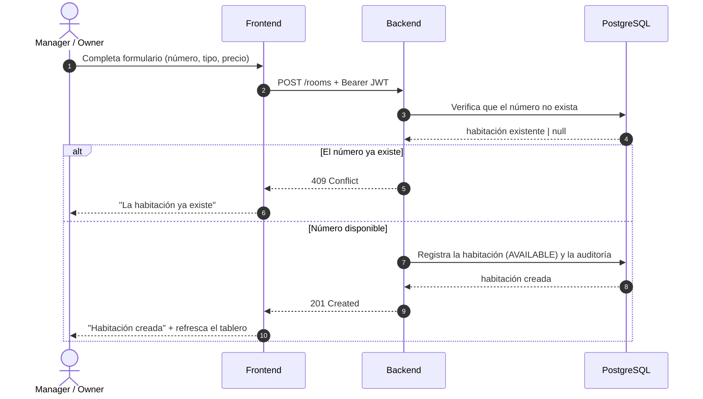
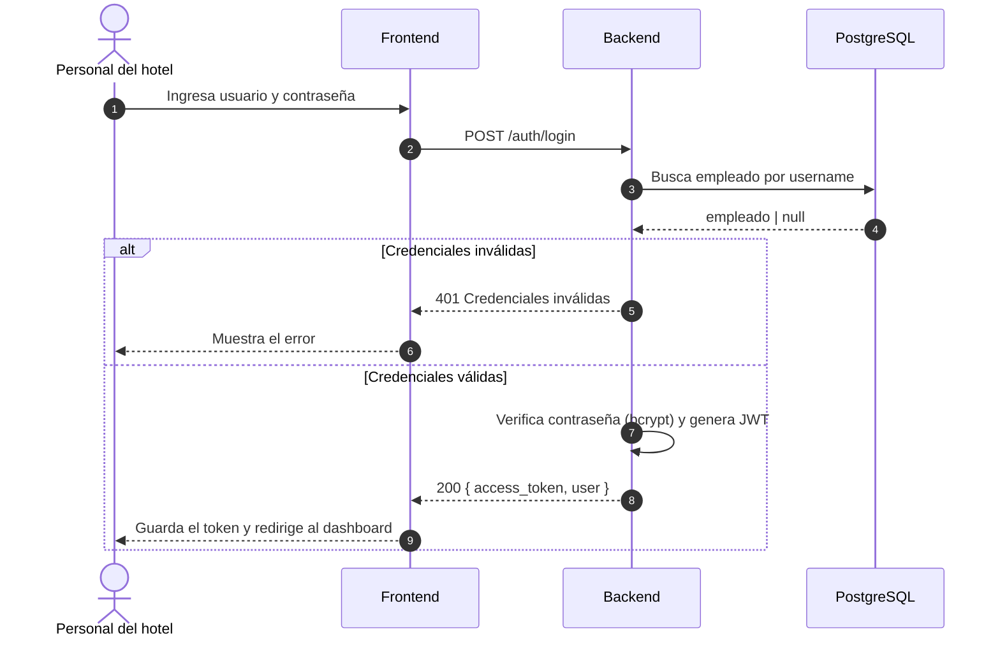
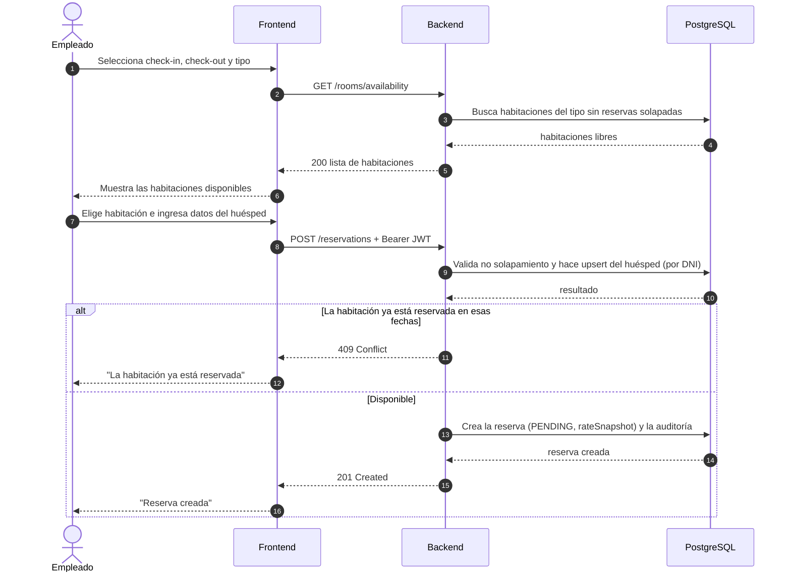
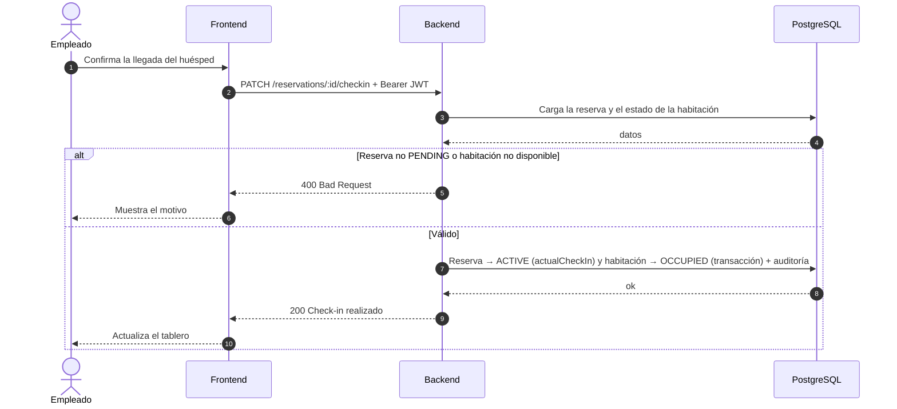
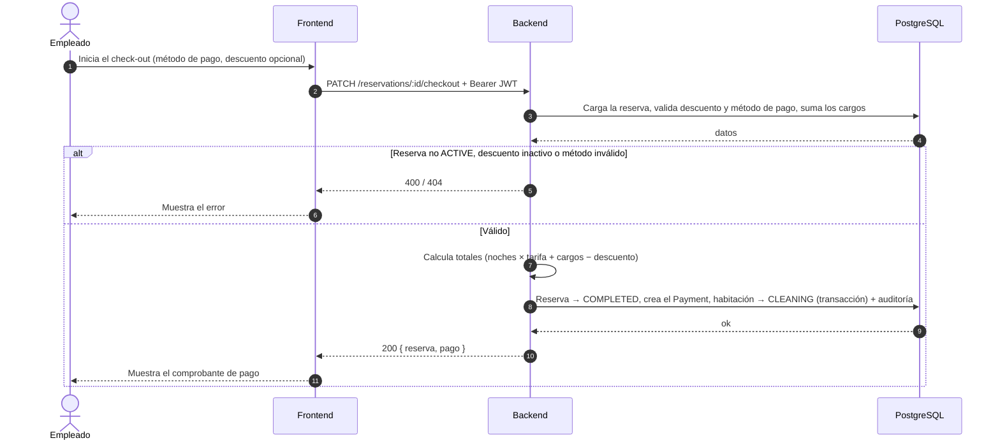
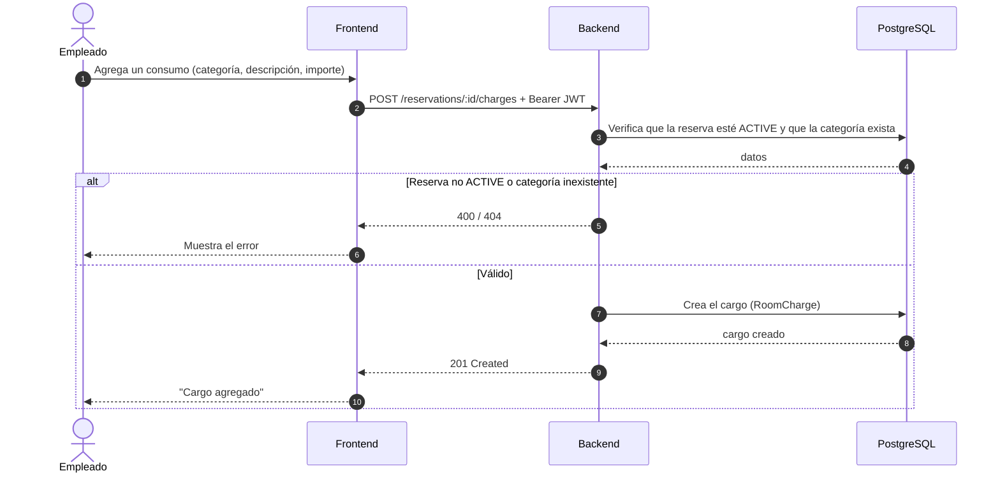

# Diagramas de Secuencia (vista resumida) — Lumina Resort PMS

## Descripción

Esta es la **vista resumida** de los diagramas de secuencia. Modela cada escenario con tres
participantes de alto nivel —**Frontend**, **Backend** y **PostgreSQL**— más el actor, sin
desglosar las capas internas del backend (guards, controlador, servicio, ORM). Su objetivo
es comunicar el flujo de negocio de un vistazo.

La contraparte con el detalle técnico completo (guards, `Controller` → `Service` →
`PrismaService`) está en [`secuencias-detallado.md`](./secuencias-detallado.md).

Convención: flecha continua (`->>`) = invocación · flecha punteada (`-->>`) = retorno ·
`alt`/`else` = caminos excluyentes (error u éxito).

---

## Secuencia 1 · Crear habitación

Realiza el caso de uso **CU-11**. Un Manager u Owner registra una nueva habitación; el
sistema valida que el número no exista y la crea en estado `AVAILABLE`.

### Notas

- La validación de token y rol (`OWNER`/`MANAGER`) ocurre en el backend antes de procesar la
  petición; en esta vista se omite por simplicidad y se detalla en la versión completa.
- La creación de la habitación y su registro de auditoría se resumen en un solo paso de
  escritura.

---

## Secuencia 2 · Iniciar sesión

Realiza el caso de uso **CU-01**. El usuario se autentica y el sistema emite un token JWT.

### Notas

- La contraseña nunca viaja de vuelta: el backend la verifica con bcrypt y solo devuelve el
  token y los datos básicos del usuario.

---

## Secuencia 3 · Crear reserva

Realiza los casos de uso **CU-02** y **CU-03**. El flujo "fecha + tipo primero": el actor
consulta la disponibilidad y luego crea la reserva sobre una habitación libre.

### Notas

- La disponibilidad se calcula por **solapamiento de fechas** sobre reservas
  `PENDING`/`ACTIVE`, no por el estado físico del cuarto.
- El precio se congela en `rateSnapshot` al momento de crear la reserva.

---

## Secuencia 4 · Realizar check-in

Realiza el caso de uso **CU-06**. Registra la llegada del huésped y ocupa la habitación.

### Notas

- El cambio de estado de la reserva y de la habitación se ejecuta en una **transacción**:
  ambos cambios ocurren juntos o no ocurre ninguno.

---

## Secuencia 5 · Realizar check-out y cobro

Realiza el caso de uso **CU-07**. Cierra la estancia, calcula el total y registra el pago.

### Notas

- El total se compone de `roomTotal` (noches × tarifa) + `chargesTotal` (cargos) −
  `discountAmount`; todos los importes quedan congelados en el `Payment`.
- Tras el cobro la habitación pasa a `CLEANING`, alimentando la vista de housekeeping.

---

## Secuencia 6 · Registrar cargo a la reserva

Realiza el caso de uso **CU-08**. Agrega un consumo o servicio a una reserva en curso.

### Notas

- Solo se permiten cargos sobre reservas `ACTIVE` (huésped con check-in hecho y sin
  check-out). El cargo se sumará al `chargesTotal` durante el check-out (Secuencia 5).
